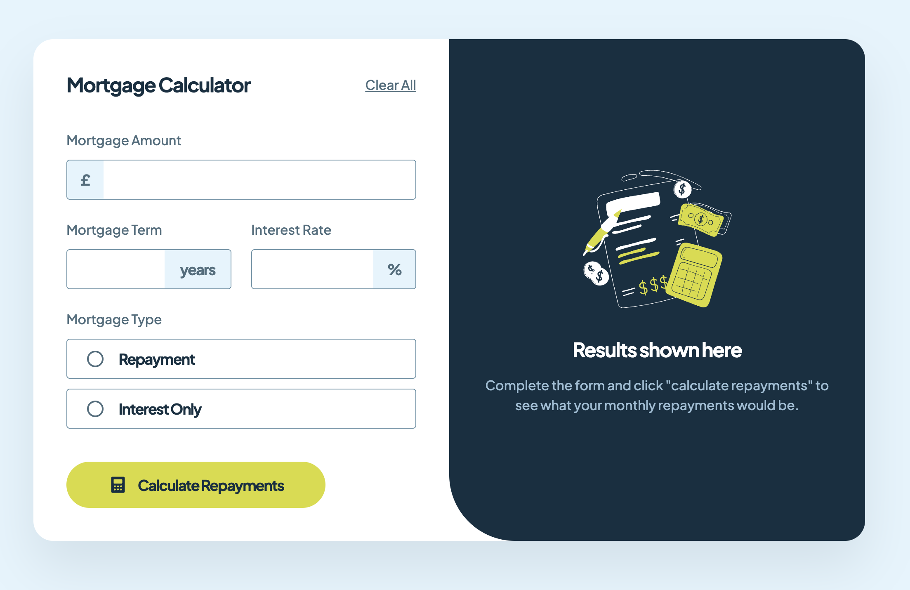
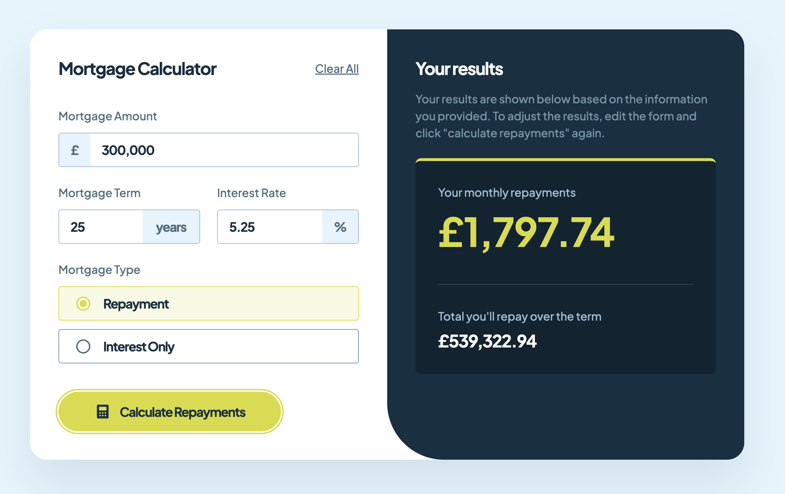

# Mortgage Repayment Calculator

## Table of contents

- [Overview](#overview)
  - [Screenshot](#screenshot)
  - [Links](#links)
- [My process](#my-process)
  - [Built with](#built-with)
- [Author](#author)

## Overview

### Screenshot

### Links

- Solution URL: [Solution URL](https://github.com/kisu-seo/mortgage_repayment_calculator)
- Live Site URL: [Live URL](https://kisu-seo.github.io/mortgage_repayment_calculator/)

## My process

### Built with

- **Vanilla JavaScript** — Pure DOM manipulation without any frameworks. Features include real-time formatted inputs (thousands separators), custom form validation, result state toggling, and complex mortgage calculations.
- **Tailwind CSS v3 (via CDN)** — Styling implemented entirely through utility classes. Design system tokens (colors, typography presets, spacing) are mapped 1:1 via an embedded `tailwind.config` object within `index.html`.
- **Advanced Tailwind Features** — Utilizes `group-focus-within`, `has-[:checked]`, `peer`, and combined variants (`focus-within:hover:`) to create intricate interactive UI styling (like custom radio buttons) strictly through utilities.
- **Semantic HTML5 Markup** — Structured with `<main>`, `<section>`, `<form>`, and `<fieldset>` tags for a meaningful and logical document outline.
- **Mobile-First Responsive Layout** — Uses Flexbox and Tailwind breakpoints (`md:`, `lg:`) to adapt the application from a vertical stack on mobile to a side-by-side layout on larger screens, including custom dynamic border-radius rules.
- **Web Accessibility (A11y)**
  - Comprehensive form accessibility using associated `<label>`s, `aria-describedby`, and `aria-required`.
  - Dynamic result state toggling communicated appropriately to screen readers via `aria-live="polite"`.
  - Instant validation error feedback exposed using `role="alert"`.
  - Radio buttons built with native inputs hidden via `sr-only` to preserve keyboard navigation and focus states.
- **Google Fonts** — Integrated `Plus Jakarta Sans` for all text to match the design specification.

## Author

- Website - [Kisu Seo](https://github.com/kisu-seo)
- Frontend Mentor - [@kisu-seo](https://www.frontendmentor.io/profile/kisu-seo)
